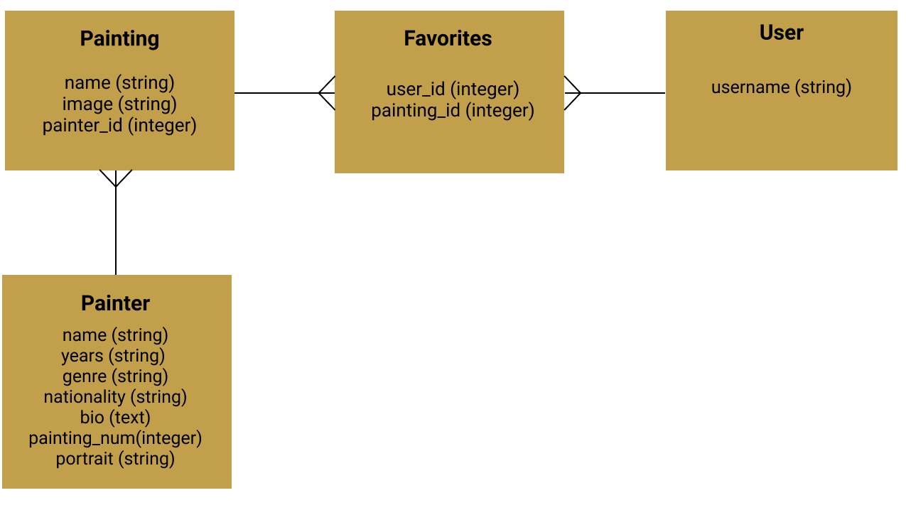

# Mod3_Project_Javascript_Frontend
Art Gallery is a full stack web application where you can browse around the gallery of famous artists' paintings. The inspiration of this app came during the time of COVID when most of the museums were closed. Art Gallery provides an opportunity to learn more about painters and their artworks.
## Getting Started
### Launching Frontend
* Have the rails server running on "localhost:3000"
* cd into Mod3_Project_Javascript_Frontend
* Open html file in browser  
  ```$ open gallery.html```
### CRUD Operations
* User is able to enter the name and the username
* User is able to add paintings to their favorites 
* User can click on a Painting and either see more information about it or add it to their favorites 
* User can remove paintings from favorites
* User is able to learn more about a particular artist that drew the painting that they clicked 
## Project Images 📷
### User Login and Change Username Forms


* User is able to login along with changing his username
### Gallery Page

* Browse all the paintings of famous artists

* Put like which will add the painting into the favorites

### Favorites Page

* See all the favorites

* Remove from Favorites
## Features
### User Login and Change Username


### Add to Favorites


### Delete from Favorites

### Learn more about a painting and its artist from both painting page and artist's page


### ActiveRecord Associations
* There are 4 models with `has_many`, `belongs_to` and `has_many through` associations
### Domain Model
 </img>
## Tech Stack
* Vanilla JavaScript (Frontend)
* Ruby on Rails API (Backend: https://github.com/Elronia/Mod3_Project_Gallery_Rails_Backend)
* PostgreSQL
* HTML
* CSS
* Active Record
## Tools
* [Rack CORS](https://github.com/cyu/rack-cors)
* [ActiveModel::Serializer](https://github.com/rails-api/active_model_serializers)
## Creators
* [Ekaterina Zarudnaya](https://github.com/Elronia)
* [Patrick Pierre](https://github.com/pierrewebdev)
